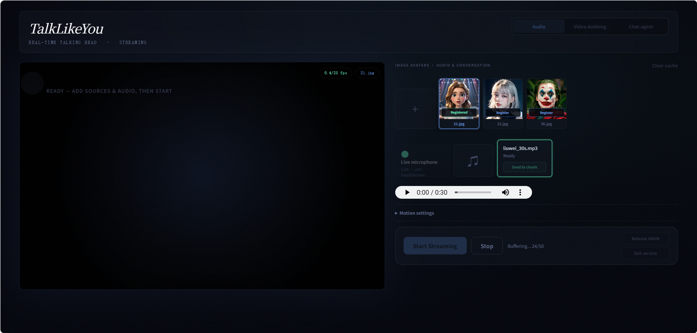

# Streaming RealTime Demo

[English](README.md) | [简体中文](README.zh-CN.md)

这个浏览器 Demo 可以实时生成说话人脸视频。你可以用上传的音频或实时麦克风驱动一张头像，为源视频配音并保留原有姿态与时序，或连接聊天智能体实现交互式语音驱动动画。预设的说话习惯 ID 可以直接切换说话风格，无需参考视频。

**在 NVIDIA RTX 3090 上，Demo 的生成吞吐速度可达到 30+ FPS，显存占用低于 4 GB，同时呈现清晰的人脸细节。**



[](https://bq-wang0511.github.io/TalkLikeYou/)
[](https://arxiv.org/abs/2610.06658)
[](https://huggingface.co/doubi-killer/TalkLikeYou)
[](https://github.com/BQ-Wang0511/TalkLikeYou)

本仓库包含推理代码、人像运行模块和前端。模型权重需另行放入本地 `checkpoints/` 目录；运行时代码不会读取其他仓库中的文件。

## 视频展示

<video src="https://github.com/user-attachments/assets/bea580f3-7d1b-419a-9665-b69113b94e35" controls preload="metadata"></video>

[观看 Demo 视频](https://bq-wang0511.github.io/TalkLikeYou/static/videos/realtime-demo.mp4)

## 功能

界面提供三种模式：

- **Audio（音频）**：用上传的音频文件或实时麦克风驱动图片头像。
- **Video dubbing（视频配音）**：替换源视频中的说话动作，同时保留原有姿态和时序。
- **Chat agent（聊天智能体）**：连接兼容 OpenAI 接口的聊天与语音识别服务，流式生成语音驱动的人像动画。

三种模式共用缓存的人像预处理结果和流式渲染器。Audio 与 Chat agent 使用图片头像；Video dubbing 使用视频头像，不需要动作参考文件或说话习惯参考文件。

## 安装

需要 Linux、NVIDIA GPU 和 FFmpeg。测试环境为 Python 3.10、CUDA 12.1 和 cuDNN 9。

```bash
conda env create -f environment.yaml
conda activate talklikeyou-demo
```

也可以先安装兼容当前 CUDA 环境的 PyTorch，再运行：

```bash
pip install -r requirements.txt
```

## 运行

```bash
cd TalkLikeYou-Streaming-RealTime-Demo
CUDA_VISIBLE_DEVICES=0 python app.py --host 0.0.0.0 --port 5070
```

打开 `http://127.0.0.1:5070`。上传源素材时会进行一次头像注册，之后的运行可复用缓存特征。Audio 和 Chat agent 使用图片源，Video dubbing 使用视频源。视频源不需要动作参考文件。

### Audio（音频）

选择 **Audio**，上传图片头像，然后选择音频文件或 **Live microphone（实时麦克风）**。注册完成后，点击 **Start Streaming（开始流式生成）**。推荐的预设说话习惯 ID 为 `192`、`166` 和 `202`。

### Video dubbing（视频配音）

选择 **Video dubbing**，上传源视频，选择音频文件并开始流式生成。生成结果保留源视频的姿态和时序，同时替换说话动作。随附的 `data/neutral.pkl` 动作模板提供中性嘴部表情，无需中性参考图片。

### Chat agent（聊天智能体）

按下文配置服务，选择 **Chat agent**，上传图片头像，然后输入文字或录制语音。回复文字、合成语音和头像画面会逐步流式输出。如果浏览器支持，可以使用浏览器语音识别；否则由已配置的 STT 接口处理录音。

等效的启动脚本为：

```bash
CUDA_VISIBLE_DEVICES=0 ./run.sh
```

命令行客户端支持 Audio 和 Video dubbing：

```bash
python demo_client.py --source path/to/source.jpg --audio path/to/audio.wav
python demo_client.py --source path/to/source.mp4 --audio path/to/audio.wav
```

## 界面控件

### 模式与素材

| 控件 | 说明 |
| --- | --- |
| **Audio** | 使用图片头像，由上传的音频文件或实时麦克风驱动。 |
| **Video dubbing** | 使用源视频，保留其原有姿态和时序，替换与说话相关的嘴部动作。 |
| **Chat agent** | 将文字或录音发送到已配置的对话服务，并流式输出回复、合成语音和头像画面。 |
| **Add source** | 在 Audio/Chat agent 模式上传图片头像，在 Video dubbing 模式上传视频头像；点击素材卡片可将其设为当前源。 |
| **Register** | 检测选定的人脸并缓存人像特征；注册图片时还会自动准备中性素材。 |
| **Neutralize** | 出现在视频源卡片上。启用 **Neutral** 时，应在播放前执行；它会将随附的中性动作应用到源视频的每一帧并缓存结果。 |
| **Add audio** | 上传一个或多个音频文件；点击音频卡片即可选中。 |
| **Live microphone** | 在 Audio 模式下流式采集麦克风音频；建议使用耳机以避免回声。 |
| **Clear cache** | 删除已注册的头像特征缓存；之后需要重新注册素材。 |

### 动作设置

| 参数 | 默认值 | 说明 |
| --- | ---: | --- |
| **Lip person ID** | `192` | 选择嘴部生成使用的预设说话习惯。推荐 ID：`192`、`166`、`202`。 |
| **Lip guidance** | `1.3` | 嘴部生成器的无分类器引导强度。数值越高，所选习惯越明显，但动作也可能过于夸张。 |
| **Pose person ID** | `274` | 选择 Flow Matching 姿态分支的预设习惯；仅在图片头像且关闭 **Ditto pose** 时可用。 |
| **Pose guidance** | `1.5` | Flow Matching 姿态分支的引导强度；开启 **Ditto pose** 时无效。 |
| **Sampling steps** | `1` | Flow Matching 采样步数。论文与推荐的实时设置均为一步。开启 Ditto 姿态时，此值也控制其采样步数；增加步数会提高延迟。 |
| **Motion chunk (frames)** | `50` | 每批流式生成的动作帧数。较小的批次可缩短响应等待，但会增加调度开销；较大的批次更有利于吞吐速度。 |
| **Preview FPS** | `25` | 浏览器播放和渲染帧率，范围为 `1–50`；原生动作帧率为 25 FPS。 |
| **Max image size (long edge)** | `1024` | 上传图片的长边超过此值时进行缩小；不会放大小图，也不会调整视频源尺寸。修改后需重新上传图片。 |
| **Face index** | `0` | 多人脸时选择人脸序号，按从左到右排列，从零开始。修改后已有注册结果将失效。 |
| **Crop scale** | `2.3` | 控制所选人脸周围的裁剪范围；数值越大，裁剪区域越宽。修改后需重新注册。 |
| **Playback buffer (frames)** | `75` | 播放前请求缓存的帧数，受可用动作批次限制；实时麦克风使用一帧，流式 Chat agent 语音最多使用十帧。 |
| **Audio chunk (seconds)** | `1.0` | 每次提交给动作生成器的 16 kHz 音频长度。较小的值可改善响应速度，但会增加每批处理开销。 |
| **Stage0** | 开 | 相对于中性动作模板生成嘴部动作，并启用嘴部归一化；推荐开启，以获得从源嘴部状态到动画的稳定过渡。 |
| **Neutral** | 开 | 在动画生成前，将源素材渲染为中性嘴部表情。图片头像在注册时自动准备；视频头像需执行 **Neutralize**。 |
| **Per-frame normalize ΔE** | 关 | 对源视频的每帧分别计算嘴部归一化偏移。仅在 Video dubbing 模式下开启 **Stage0**、关闭 **Neutral** 时可用，且需在启用此选项后注册视频。 |
| **Ditto pose** | 开 | 对图片头像使用 Ditto 的音频驱动姿态生成器。关闭后可使用 **Pose person ID** 和 **Pose guidance**；Video dubbing 始终使用源视频姿态。 |
| **Paste back** | 开 | 将动画人脸裁剪区域合成回原始源帧。关闭后可预览裁剪人像输出。 |
| **Continuous idle** | 关 | 上传的有限长度音频结束后继续生成待机动作；Video dubbing、实时麦克风和流式 Chat agent 语音不支持。 |
| **Play microphone audio** | 开 | 在 Audio 模式播放本地麦克风监听音频；仅选择 **Live microphone** 后显示。 |

`data/neutral.pkl` 仅保存预提取的人像动作模板和表情。它取代了此前的中性参考图片，避免注册时额外进行一次人脸检测；可通过 `--neutral_motion` 或环境变量 `NEUTRAL_MOTION` 覆盖。

### Chat agent 设置

| 参数 | 说明 |
| --- | --- |
| **System prompt** | 覆盖当前对话中服务端的默认指令；留空则使用服务端默认设置。 |
| **LLM model** | 选择或手动指定可用的、兼容 OpenAI 接口的聊天模型；留空则使用已配置的默认模型。 |
| **TTS provider** | 选择 Edge TTS 或已配置的兼容 OpenAI 接口的语音服务。 |
| **TTS model** | 覆盖兼容 OpenAI 接口的 TTS 服务的模型；Edge TTS 不使用此项。 |
| **TTS voice** | 选择当前 TTS 服务提供的合成音色。 |
| **Streaming TTS** | 在回复片段到达时立即开始语音合成和头像动作，而不是等待完整回复；默认开启。 |
| **Record** | 已配置服务端 STT 时录音并发送给该服务；否则在浏览器支持的情况下使用浏览器语音识别。 |
| **Clear** | 清空可见对话，开始新的本地对话上下文。 |

### 播放与服务操作

| 控件 | 说明 |
| --- | --- |
| **Start Streaming** | 开始所选的 Audio 或 Video dubbing 任务；在 Chat agent 模式中，发送消息后会自动开始流式输出。 |
| **Stop** | 停止当前流式任务，但保留已注册的头像缓存。 |
| **Release VRAM** | 卸载常驻的推理模型；下次推理请求会重新加载。 |
| **Exit service** | 请求正常关闭 Demo 服务。 |

运行时上传文件和头像缓存默认保存在 `/tmp/talklikeyou_demo`；设置 `TALKLIKEYOU_STORAGE_DIR` 可更改位置。

## Chat agent 配置

安装依赖后即可使用 Edge TTS。聊天和服务端语音识别使用兼容 OpenAI 接口的服务。启动服务前导出所需变量，或将其写入本地 `.env` 文件：

```bash
export TALKLIKEYOU_LLM_BASE_URL=https://example.com/v1
export TALKLIKEYOU_LLM_API_KEY=your_key
export TALKLIKEYOU_LLM_MODEL=qwen-flash

export TALKLIKEYOU_STT_BASE_URL=https://example.com/v1
export TALKLIKEYOU_STT_API_KEY=your_key
export TALKLIKEYOU_STT_MODEL=whisper-1
```

若需以兼容 OpenAI 接口的 TTS 服务替代 Edge TTS，可设置 `TALKLIKEYOU_TTS_PROVIDER=openai_compatible`、`TALKLIKEYOU_TTS_BASE_URL`、`TALKLIKEYOU_TTS_API_KEY`、`TALKLIKEYOU_TTS_MODEL` 和 `TALKLIKEYOU_TTS_VOICE`。

## 模型权重

论文版模型权重托管于 [Hugging Face](https://huggingface.co/doubi-killer/TalkLikeYou)。本 Demo 要求如下本地目录结构：

```text
checkpoints/
├── motion/
│   ├── audio_encoder.pth
│   ├── lip_motion.pt
│   └── pose_motion.pt
├── runtime/
│   ├── aux_models/
│   └── models/
└── runtime_config.pkl
```

- `checkpoints/motion/`：音频编码器，以及以说话习惯为条件的嘴部和姿态生成器。
- `checkpoints/runtime/`：实时人像渲染器、人脸关键点和音频特征模型。
- `checkpoints/runtime_config.pkl`：使用本地相对路径的运行配置。

只需下载共用的论文素材和两个 Demo 专用动作权重，再按上述结构放置：

```bash
hf download doubi-killer/TalkLikeYou \
  --include "checkpoints/audio_encoder.pth" \
            "checkpoints/ditto/ditto_pytorch/**" \
            "checkpoints/motion/lip_motion.pt" \
            "checkpoints/motion/pose_motion.pt" \
  --local-dir hf_assets

mkdir -p checkpoints/motion checkpoints/runtime
cp hf_assets/checkpoints/audio_encoder.pth checkpoints/motion/
cp hf_assets/checkpoints/motion/lip_motion.pt checkpoints/motion/
cp hf_assets/checkpoints/motion/pose_motion.pt checkpoints/motion/
cp -a hf_assets/checkpoints/ditto/ditto_pytorch/. checkpoints/runtime/
```

`runtime_config.pkl` 已包含在源码中，无需单独下载。

论文代码仓库与本 Demo 的权重已逐项对比：

| 论文代码仓库 | 实时 Demo | 兼容性 |
| --- | --- | --- |
| `checkpoints/audio_encoder.pth` | `checkpoints/motion/audio_encoder.pth` | 相同，可直接复用 |
| `checkpoints/ditto/ditto_pytorch/` | `checkpoints/runtime/` | 兼容，模型参数相同 |
| `checkpoints/ditto/ditto_cfg/v0.4_hubert_cfg_pytorch.pkl` | `checkpoints/runtime_config.pkl` | 兼容；Demo 配置移除了未使用的 WavLM 条目，改用本地相对路径 |
| `checkpoints/motion_generator.pt` | `checkpoints/motion/lip_motion.pt` | 模型参数不同；Demo 权重单独发布 |
| 论文流程不使用 | `checkpoints/motion/pose_motion.pt` | Demo 专用权重，发布于同一 Hugging Face 仓库 |

Demo 专用的 `lip_motion.pt` 和 `pose_motion.pt` 已上传至同一 Hugging Face 仓库。论文模型的 `motion_generator.pt` 是另一套模型，不能重命名或替代 `lip_motion.pt`。

可使用 `--lip_ckpt`、`--pose_ckpt`、`--data_root` 和 `--cfg_pkl` 覆盖默认路径。不要把 `motion_generator.pt` 重命名为 `lip_motion.pt`；两者的模型定义和参数不同。

## 致谢

人像渲染器采用了基于 [Ditto](https://github.com/antgroup/ditto-talkinghead) 改编的组件，人像预处理采用了基于 [LivePortrait](https://github.com/KwaiVGI/LivePortrait) 改编的组件。感谢两个团队公开相关工作。适用的许可证见[第三方声明](THIRD_PARTY_NOTICES.md)。

## 许可证

Demo 代码采用 [MIT 许可证](LICENSE)。第三方代码和模型文件仍受各自原始条款约束；参见[第三方声明](THIRD_PARTY_NOTICES.md)。

## 联系方式

如有问题，请联系 [wangbaiqin0511@gmail.com](mailto:wangbaiqin0511@gmail.com)。
